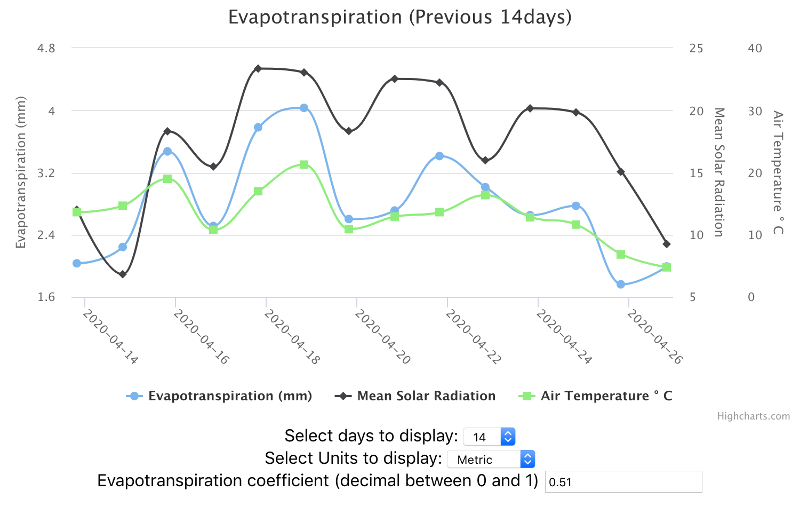
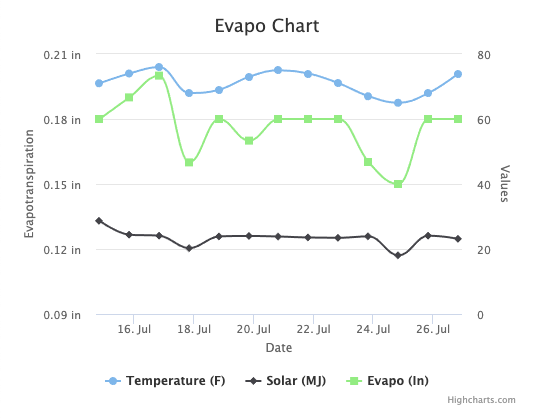

# Altrac Frontend Developer Test

## Dean Glueckler

### (Scroll down to see the overview of the challenge)

Below the chart are three inputs to change the data displayed. Upon changing the inputs the chart will refresh.

I also included some basic error handling.

## Overview

A small exercise to determine if you have some basic JavaScript, React and data manipulation skills as well as an understanding of how to deploy JS websites.

The goal is to build a one-page site that loads and displays [Evapotranspiration](https://en.wikipedia.org/wiki/Evapotranspiration) data from a weather station through our API and chart it in [HighCharts](https://www.highcharts.com/).

You can present this in any way you like, with the following conditions:

- The site must load live data from our API. It should show at least 3 days of data
- The website must be deployed to AWS S3 (if it is not deployed there, it will encounter CORS issues)
- You must use HighCharts for charting
- You must use the React library for building the user interface

## Example

Below is a very simple chart I mocked up using HighCharts and deployed to S3. It shows Evapotranspiration in inches as well as temperature and solar data.

## Details

The API request can be made with the following URL: https://stage.altrac-api.com/evapo/address/26002e000c51343334363138?date=2020-07-27&tzOffset=-7&elevation=160.9&latitude=43.2624613&Kc=0.51

- stage = Our production API does not allow for CORS requests
- 26002e000c51343334363138 = ID of device
- 2020-07-27 = Date of requested data
- -7 = time zone offset
- 160.9 = elevation of weather station in meters
- 43.2624613 = latitude of weather station
- 0.51 = Evapotranspiration coefficient

## Assessment

Once completed, please email us a link to both the deployed site and fork of this repo showing your code. We will review it with the following in mind:

- Does the website load?
- Is the website using React? Does the React code make sense?
- Are there instruction on how to run or deploy the code?

If for some reason you cannot deploy to S3, this won't necessarily disqualify you, but you should provide a reason.

Some extra credit (but please don't spend much time on this):

- Website is bundled via webpack, and there is a webpack configuration file that runs and generates bundled code
- The website has some live controls that work without page reload. Some ideas:
  - Ability to change date range and reload data
  - Change from metric to standard units
  - Change the Evapotranspiration coefficient
- Display chart data in a simple table

## Questions or Issues

If you've run into any issues or have questions, please email support@altrac.io

## Create React App

In the project directory, you can run:

### `npm start`

Runs the app in the development mode. 
Open [http://localhost:3000](http://localhost:3000) to view it in the browser.

The page will reload if you make edits. 
You will also see any lint errors in the console.

### `npm test`

Launches the test runner in the interactive watch mode. 
See the section about [running tests](https://facebook.github.io/create-react-app/docs/running-tests) for more information.

### `npm run build`

Builds the app for production to the `build` folder. 
It correctly bundles React in production mode and optimizes the build for the best performance.

The build is minified and the filenames include the hashes. 
Your app is ready to be deployed!

See the section about [deployment](https://facebook.github.io/create-react-app/docs/deployment) for more information.
